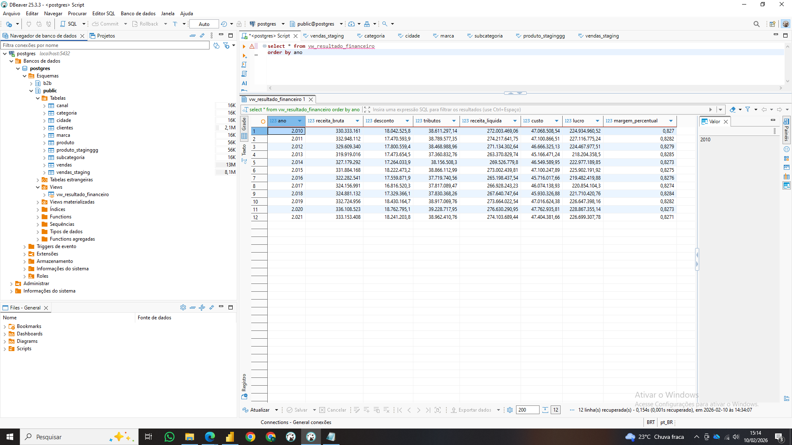

## Sales Analytics – SQL + Power BI

Projeto de Business Intelligence com foco em métricas financeiras,
replicando em SQL (PostgreSQL) a lógica analítica originalmente
desenvolvida em Power BI (DAX).

### Pipeline
- Ingestão de CSV via terminal (psql \copy)
- Modelagem relacional (tabela fato e dimensão)
- Criação de views financeiras em SQL

### Métricas principais
- Receita Bruta
- Receita Líquida
- Custo
- Lucro
- Margem %
## Resultado Financeiro

Durante o desenvolvimento do projeto, os dados originais estavam em arquivos Excel (.xlsx), o que exigiu uma etapa inicial de preparação. Os arquivos foram convertidos manualmente para CSV, garantindo controle sobre separadores, codificação e formatação numérica antes da ingestão no banco.

A carga inicial foi feita em uma tabela de staging, criada propositalmente sem restrições rígidas, permitindo receber os dados brutos exatamente como estavam na origem. Embora o DBeaver ofereça importação via interface gráfica, essa abordagem apresentou limitações importantes: tipagem automática imprecisa, conversão incorreta de campos numéricos e datas, e pouca transparência sobre o processo de carga.

Para evitar esses problemas, a ingestão foi realizada via terminal SQL utilizando o comando COPY (\copy), o que garantiu:

controle explícito sobre delimitadores e encoding

carga mais rápida e confiável

fidelidade total aos dados originais

Após a carga no staging, foi feita a conversão manual dos tipos de dados (datas, numéricos e chaves), etapa fundamental para assegurar consistência analítica e evitar distorções nas métricas financeiras posteriores.

Essa abordagem reforça a importância de não depender exclusivamente de interfaces gráficas em pipelines de dados e evidencia o papel do SQL e do controle manual de tipagem como base para análises confiáveis em projetos de BI.

